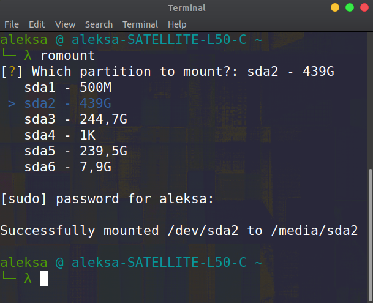

# romount [](https://github.com/AleksaC/romount/blob/master/LICENSE)

CLI tool for mounting partitions in read-only mode.

## About

If you're using a Linux/Windows dual boot odds are you wanted to use some files 
from Windows partition while working on Linux but encountered an error whereby 
you can only access the partition if it has been mounted in read only mode. 
If you're like me you had to google how to do that every time. That's why I 
decided to create a simple CLI tool that lists unmounted partition and allows you
to select the one you want to mount.

## Screenshot



## Setup

```shell script
git clone https://github.com/AleksaC/romount
cd romount
python -m install .
```

This most likely adds the romount script to ~/.local/bin. To be able to use it 
you need to add this location to the PATH by adding `export PATH=~/.local/bin:$PATH`
to `~/.profile`. You need to log out for this to take effect. 

## Contact 🙋‍♂️
If you have any type of inquiry or there's something you want to tell me 
you can contact me at my [personal website](https://aleksac.me) or via social 
media linked there. If you'd like to be among the first people to find about my 
future endeavors you should follow me on twitter: 
<a target="_blank" href="http://twitter.com/aleksa_c_"></a>
